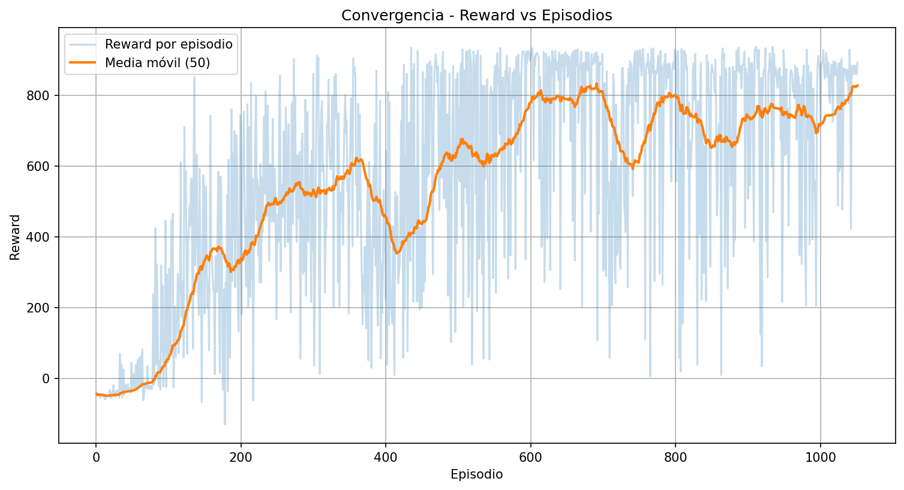
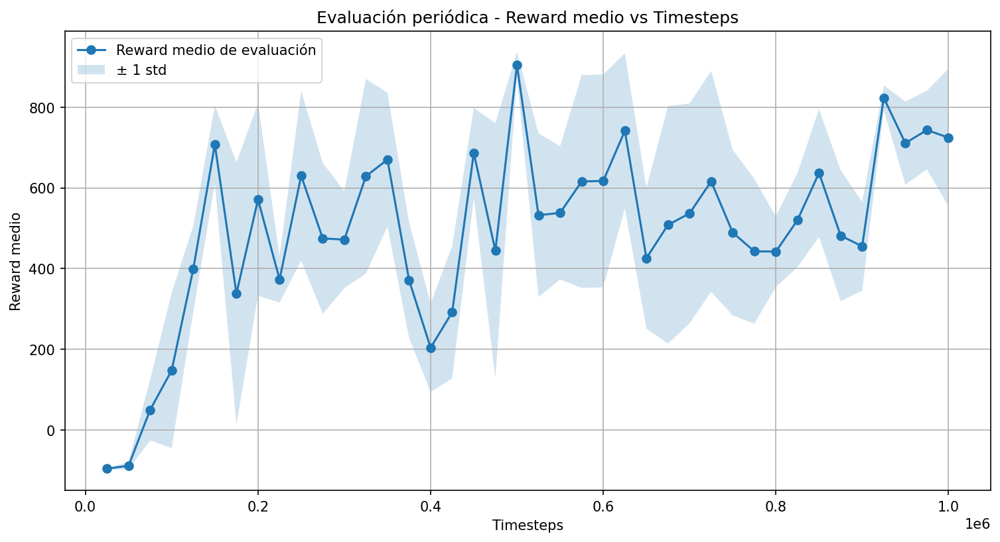

## 10_observation_resize

### Configuración:

Dado que las corridas `08_validation_multiseed_seed1` y `09_validation_multiseed_seed2` mostraron que la configuración de `07_longrun_bestcfg` no era suficientemente robusta y que un reward alto no siempre implicaba una conducción correcta, para esta nueva corrida decidimos cambiar la representación de la observación. Tomamos como base `07_longrun_bestcfg` y aplicamos un único cambio en el entrenamiento: incorporar **resize de la observación a `(84, 84)`**, mientras que en todas las corridas anteriores se había trabajado con el tamaño original del entorno: imágenes de (96, 96). El motivo fue que una entrada visual más compacta podía reducir ruido, simplificar la percepción de la pista y favorecer un aprendizaje más estable, sin modificar el algoritmo ni el resto de la configuración.

## Resultados:

Los resultados cuantitativos fueron muy buenos y mostraron una mejora importante en la calidad del entrenamiento. Luego de un comienzo flojo en las primeras evaluaciones, el `reward_mean` creció rápidamente y alcanzó valores altos de manera sostenida: llegó a aproximadamente **398.8** en 125k timesteps, **707.7** en 150k, **630.1** en 250k, **670.0** en 350k, **904.8** en 500k, **741.4** en 625k, **823.3** en 925k y finalizó en **724.5** a 1.000.000 de timesteps.

En términos cualitativos, el video mostró una mejora clara respecto de la familia de corridas basada en `07_longrun_bestcfg`: el auto logró completar correctamente una vuelta completa y, aunque en algunas ocasiones se desvió parcialmente, no se salió totalmente de la pista ni mostró comportamientos incorrectos como volver en sentido contrario.

En conjunto, esta corrida mostró que el cambio de observación mediante resize fue una mejora real. A diferencia de las corridas anteriores, aquí hubo una combinación favorable entre rendimiento cuantitativo alto y comportamiento visual consistente, lo que convirtió a `10_observation_resize` en la mejor corrida obtenida hasta ese momento. Además, este resultado sugirió que una parte importante del problema no estaba solo en PPO o en sus hiperparámetros, sino también en cómo el agente procesaba la información visual del entorno.

Se puede ver el detalle de los resultados en la notebook eval y en el video.

[`video`](experiments/carracing_ppo/run_20260424_113851_seed0/videos/best_model_eval-step-0-to-step-2000.mp4)

