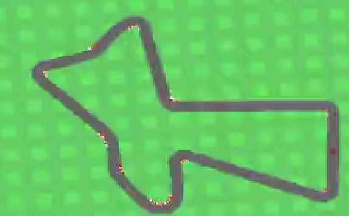
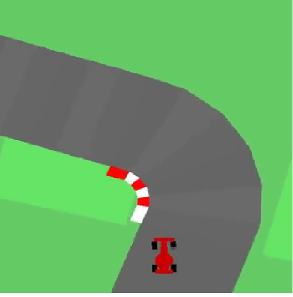

# Car Racing

Elegimos **Car Racing** porque representa un problema de aprendizaje por refuerzo muy completo: el agente debe **aprender a conducir a partir de imágenes**, tomando acciones continuas para maximizar una recompensa acumulada.

Este entorno combina varias dificultades relevantes. Por un lado, no recibe un estado simple, sino una **observación visual**, por lo que debe aprender al mismo tiempo **percepción y control**. Por otro lado, el problema es de **control continuo**, ya que las acciones corresponden al giro, la aceleración y el freno, lo que lo vuelve más realista y más difícil que un problema con acciones discretas.

Además, Car Racing exige **mantener estabilidad en el tiempo**: no alcanza con elegir una buena acción aislada, sino que hace falta sostener una secuencia coherente para tomar curvas, corregir desvíos y permanecer dentro de la pista. También introduce el problema de la **generalización**, porque la pista cambia entre episodios y el agente no puede limitarse a memorizar una única trayectoria.

Resolver este entorno nos permite aprender varias cuestiones importantes de RL: cómo influye la representación de la observación, cómo se comportan los algoritmos en espacios de acción continuos, y por qué una recompensa alta no siempre implica un comportamiento correcto. Car Racing es una buena elección porque reúne **visión, control continuo, estabilidad temporal y generalización** en un mismo problema.

## Gymnasium

**Gymnasium** es una librería adecuada para este problema porque nos da un **entorno estándar, reproducible y ya implementado** para Car Racing, con una interfaz clara basada en `reset()` y `step()`. Esto nos permite concentrarnos en diseñar y entrenar el agente, en lugar de tener que construir desde cero la simulación, la física, la generación de pistas o la lógica de recompensas. Además, define de forma explícita el **espacio de observaciones**, el **espacio de acciones** y las condiciones de terminación, lo que facilita integrar algoritmos de aprendizaje por refuerzo de manera ordenada.

También es una buena elección porque está pensada para integrarse fácilmente con bibliotecas de RL como **Stable-Baselines3**, lo que simplifica mucho el entrenamiento, la evaluación y la comparación de experimentos. Además permite envolver el entorno con distintos **wrappers** para modificar observaciones, apilar frames, registrar métricas o grabar videos.

## PPO

**PPO** es una buena primera opción para este problema porque está diseñado para aprender políticas de manera estable y relativamente robusta, algo especialmente importante en un entorno como Car Racing, donde el agente debe actuar en un espacio de acciones continuas y aprender a partir de observaciones visuales. A diferencia de enfoques más sensibles o difíciles de ajustar, PPO suele ofrecer un buen equilibrio entre rendimiento, simplicidad de implementación y estabilidad de entrenamiento, por lo que resulta apropiado como punto de partida. Además, PPO está muy bien soportado en bibliotecas como Stable-Baselines3, lo que facilita construir un baseline. Como primera opción, nos permitió validar rápidamente el pipeline completo, analizar el efecto del preprocesamiento y estudiar cómo distintos cambios en la configuración influían sobre el comportamiento del agente.

### Estructura de la solución

En los subfolders puede verse el detalle completo de la solución, y en el README de cada corrida se explica específicamente qué cambio se realizó y cuál fue su resultado.

### Comentarios adicionales:

- **SAC** es una muy buena opción para continuar este trabajo porque también está pensado para control continuo, pero además incorpora una estrategia de exploración más sofisticada basada en maximizar entropía, lo que puede ayudar a obtener políticas más robustas y estables en un entorno complejo como Car Racing. Dado que en nuestros experimentos vimos que pequeñas decisiones de configuración podían producir comportamientos muy distintos entre seeds, SAC es buena opción para comparar contra PPO y analizar si logra una conducción más consistente y una mejor generalización. No avanzamos en esa línea por una cuestión de tiempo.

- **Entorno de trabajo:** Las notebooks se ejecutaron únicamente en Windows, utilizando Visual Studio Code.

- **Código:** fue desarrollado con un objetivo principalmente experimental y exploratorio, por lo que no está pensado como una solución reutilizable o productiva, y en consecuencia contiene partes repetitivas y decisiones orientadas a facilitar la iteración rápida sobre los experimentos y no la mantenibilidad.

